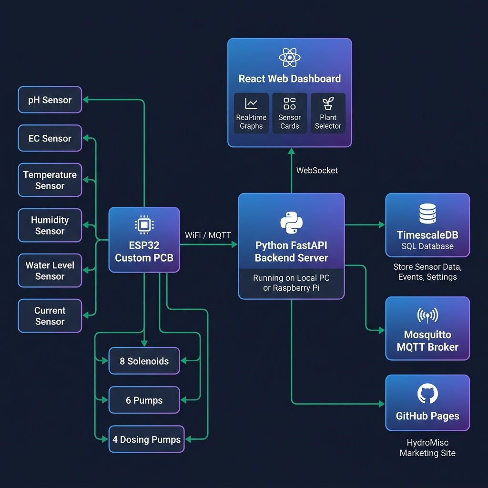
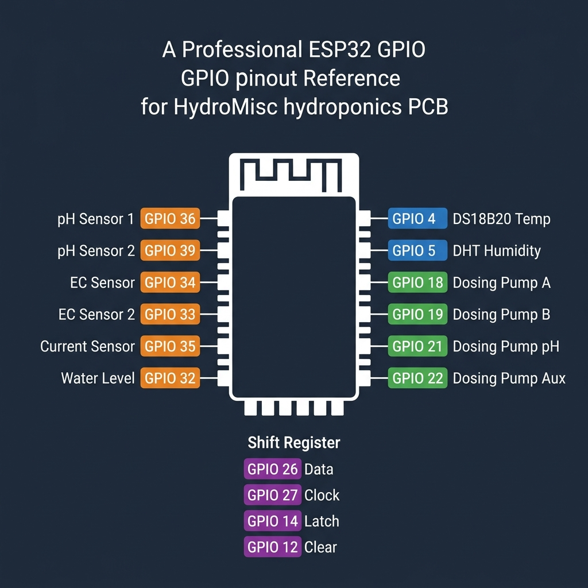
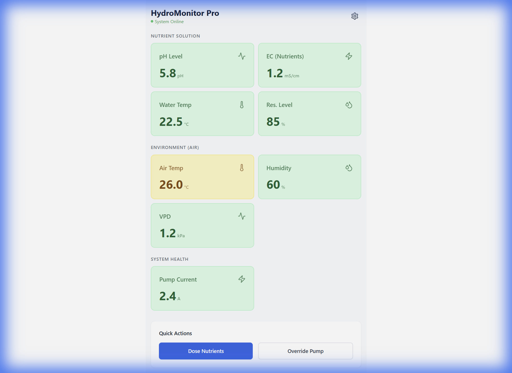

<div align="center">

# 🌿 HydroMisc — Autonomous Hydroponics Monitor

**An open-source, full-stack precision hydroponics controller.**  
Custom PCB · ESP32 Firmware · Python Backend · React Dashboard

[](https://baaboud55.github.io/Hydroponics_monitor/app/)
[](LICENSE)
[](https://www.espressif.com/)
[](https://fastapi.tiangolo.com/)
[](https://react.dev/)

</div>

---

## 📖 Overview

**HydroMisc** is a complete, production-ready hydroponics monitoring and autonomous dosing system. It was designed from the ground up to be a consumer appliance — you plug it in, connect to WiFi, select your crop, and the system automatically maintains optimal growing conditions 24/7.

The system is built around a **custom ESP32-based PCB** that reads sensors, drives actuators, and hosts the web interface directly from its flash filesystem — all without needing an internet connection.

### ✨ Key Features

| Feature | Description |
|---|---|
| 🔬 **Multi-Sensor Monitoring** | pH, EC, Dissolved O₂, Water Temp, Air Temp, Humidity, VPD, Water Level, Power Current |
| 🤖 **Autonomous PID Dosing** | Auto-maintains pH and EC using configurable PID controllers with safety limits |
| 🌐 **Zero-Touch Consumer UX** | Select a crop → system sets targets automatically. Accessible from any device on your network |
| 📡 **Real-time WebSocket Dashboard** | Live sensor data streamed to all connected browsers simultaneously |
| 📱 **Cross-Device Sync** | Backend is the single source of truth — phone and PC stay perfectly in sync |
| 💧 **8-Solenoid Irrigation Control** | Full control over 8 solenoid valves via shift register |
| ⚡ **OTA Firmware Updates** | Update firmware wirelessly via Arduino OTA or HTTP update server |
| 🗓️ **Dosing History Log** | All auto-dosing events persisted to SQLite for audit and analysis |

---

## 🏗️ System Architecture



### Data Flow

```
ESP32 Custom PCB
  ├── Reads sensors every loop cycle
  ├── Runs autonomous PID control (HydroControl library)
  ├── Serves the React dashboard via LittleFS (port 80)
  └── Publishes sensor data via MQTT
           │
           ▼  WiFi / LAN (MQTT port 1883)
  Python FastAPI Backend
  ├── Subscribes to MQTT sensor topics
  ├── Runs a parallel PID control layer
  ├── Stores config.json and dosing history (SQLite)
  ├── REST API  → http://<host>:8000
  └── WebSocket → ws://<host>:8000/ws
           │
           ▼  WebSocket (real-time push)
  React Web Dashboard
  ├── Consumer View: Plant Selector → System Visualizer
  └── Admin View: Dashboard, Automation, Parameter Config
```

---

## 🗂️ Repository Structure

```
HydroMonitor/
├── firmware/                    # ESP32 PlatformIO project (C++)
│   ├── src/
│   │   └── main.cpp             # Main firmware entry point
│   ├── lib/
│   │   ├── HydroActuators/      # Shift-register solenoid/pump driver
│   │   ├── HydroSensors/        # pH, EC, Temp, Humidity sensor drivers
│   │   ├── HydroDosingPumps/    # Peristaltic dosing pump driver
│   │   ├── HydroControl/        # On-device PID control engine
│   │   └── HydroMQTT/           # MQTT client abstraction
│   ├── data/                    # Web dashboard files (served via LittleFS)
│   └── platformio.ini           # Board config & dependencies
│
├── software/
│   ├── backend/                 # Python FastAPI server
│   │   ├── main.py              # App entry point, API routes, WebSocket
│   │   ├── control_engine.py    # PID controller & safety manager
│   │   ├── config_manager.py    # Persistent configuration (config.json)
│   │   ├── database.py          # SQLite dosing history
│   │   ├── mock_device.py       # MQTT sensor simulator for testing
│   │   └── requirements.txt
│   └── frontend/                # React + Vite dashboard
│       ├── src/
│       │   ├── components/      # UI components (10 total)
│       │   ├── hooks/           # useWebSocket
│       │   ├── services/        # api.js (all REST calls)
│       │   ├── contexts/        # LanguageContext (EN/AR bilingual)
│       │   └── App.jsx          # Router & top-level state
│       └── package.json
│
├── docs/                        # Documentation & GitHub Pages
│   ├── app/                     # GitHub Pages build output
│   └── assets/                  # Diagrams and images
│
└── README.md
```

---

## ⚡ Getting Started

### Prerequisites

| Requirement | Version | Purpose |
|---|---|---|
| Python | 3.10+ | Backend server |
| Node.js | 18+ | Frontend build toolchain |
| PlatformIO | Latest | ESP32 firmware compilation |
| Mosquitto / any MQTT broker | Any | Local MQTT relay (optional) |

---

### 1. Backend Server

```bash
cd software/backend
pip install -r requirements.txt

# Start the server (accessible on your whole local network)
uvicorn main:app --host 0.0.0.0 --port 8000 --reload
```

> On first run, `config.json` is automatically created with safe defaults.

**Key API Endpoints:**

| Method | Endpoint | Description |
|---|---|---|
| `GET` | `/api/state` | Full sensor + automation state snapshot |
| `WS` | `/ws` | Real-time WebSocket stream (1 Hz) |
| `GET` | `/api/config` | Read full configuration |
| `POST` | `/api/config/parameter` | Update pH/EC target or tolerance |
| `POST` | `/api/config/crop/{id}` | Set active crop (syncs to all browsers) |
| `POST` | `/api/config/automation/{param}/{enabled}` | Enable/disable PID automation |
| `GET` | `/api/dosing/history` | Retrieve dosing log |
| `POST` | `/api/dosing/manual` | Trigger a manual pump dose |
| `POST` | `/api/dosing/reset` | Reset PID controller state |
| `POST` | `/api/calibrate` | Send calibration command to ESP32 |
| `POST` | `/api/actuators/solenoid/{index}/{state}` | Control solenoid valve 0–7 |
| `POST` | `/api/actuators/pump/{index}/{state}` | Control circulation pump 0–5 |
| `POST` | `/api/actuators/main_pump/{state}` | Control main circulation pump |

**For testing without hardware**, set `MQTT_ENABLED = False` in `main.py` — the backend will simulate sensor data internally. Alternatively, run the MQTT mock device in a separate terminal:
```bash
python mock_device.py
```

---

### 2. Frontend Dashboard

```bash
cd software/frontend
npm install
npm run dev
```

Dashboard available at **`http://localhost:5173`**.

The app auto-detects the environment:
- **On localhost / local IP** → Boots directly into the Consumer Dashboard (no setup needed)
- **On GitHub Pages** → Boots into the Marketing Demo

To build the production bundle (outputs to `docs/app/` for GitHub Pages and `firmware/data/` for the ESP32 filesystem):
```bash
npm run build
```

---

### 3. Firmware (ESP32)

#### First-time Setup

1. Install [PlatformIO](https://platformio.org/) (VS Code extension recommended).
2. Open the `firmware/` folder in VS Code.
3. Build and upload firmware:
   ```bash
   pio run --target upload
   ```
4. Upload the web dashboard filesystem:
   ```bash
   pio run --target uploadfs
   ```

#### WiFi Configuration

On first boot, the ESP32 creates a WiFi access point:
- **SSID:** `HydroMisc-Setup`
- **Password:** `password`

Connect to it and you'll be automatically redirected to the WiFi configuration portal. Enter your network credentials and the device will restart and connect.

#### OTA (Over-The-Air) Updates

After first setup, you **never need a USB cable again**.

**Via Arduino OTA (PlatformIO):**
```bash
# platformio.ini already has: upload_protocol = espota
pio run --target upload
```

**Via HTTP Update Server:**  
Navigate to `http://hydromonitor.local/update` in your browser and upload a `.bin` file.

#### mDNS / Local DNS

The device registers itself on your network as `hydromonitor.local`. Access the dashboard at:
```
http://hydromonitor.local
```

---

## 📌 GPIO Pinout



### Analog Inputs (Sensors)

| GPIO | ADC Channel | Function |
|------|-------------|----------|
| `36` | ADC1_CH0 | pH Probe (Primary) |
| `39` | ADC1_CH3 | pH Probe (Secondary / Reference) |
| `34` | ADC1_CH6 | EC Probe (EC_0) |
| `33` | ADC1_CH5 | EC Probe (EC_1) |
| `35` | ADC1_CH7 | Current Sensor |
| `32` | ADC1_CH4 | Water Level Sensor / DC Resistance |

### Digital Inputs (Sensors)

| GPIO | Function |
|------|----------|
| `4`  | DS18B20 Water Temperature (1-Wire) |
| `5`  | DHT / AM2301 Air Temp & Humidity |

### Actuators — Direct PWM (Dosing Pumps)

| GPIO | Function |
|------|----------|
| `18` | Dosing Pump A (Nutrient A) |
| `19` | Dosing Pump B (Nutrient B) |
| `21` | Dosing Pump pH (pH Up/Down) |
| `22` | Dosing Pump Aux (Spare) |

### Actuators — Shift Register (74HC595, 16-bit chain)

| GPIO | Shift Register Pin | Function |
|------|--------------------|----------|
| `26` | SI (Data) | Shift Register Data |
| `27` | SCK (Clock) | Shift Register Clock |
| `14` | RCK (Latch) | Shift Register Latch |
| `12` | nRCLR (Clear) | Shift Register Clear (Active Low) |

**Shift Register Bit Map (16 bits):**

| Bits | Assignment |
|------|------------|
| 0–7  | Solenoid Valves 0–7 |
| 8–13 | Circulation Pumps 0–5 |
| 14   | Main Pump |
| 15   | Debug Status LED |

### EC Measurement Gates

| GPIO | Function |
|------|----------|
| `25` | EC Measurement Gate (+) |
| `15` | EC Measurement Gate (−) |

---

## ⚙️ Configuration Reference

All parameters are configurable via the dashboard **Config tab** or by editing `software/backend/config.json` directly.

```json
{
  "active_crop": "lettuce",
  "ph": {
    "target": 6.0,
    "tolerance": 0.2,
    "enabled": true,
    "min_value": 4.0,
    "max_value": 8.0
  },
  "ec": {
    "target": 1.5,
    "tolerance": 0.1,
    "enabled": false,
    "min_value": 0.5,
    "max_value": 3.0
  },
  "pid_tuning": {
    "ph": { "kp": 0.5, "ki": 0.1, "kd": 0.05 },
    "ec": { "kp": 0.3, "ki": 0.05, "kd": 0.02 }
  },
  "safety": {
    "max_ph_dose_ml": 50.0,
    "max_ec_dose_ml": 100.0,
    "min_dose_interval_sec": 300,
    "sensor_timeout_sec": 30
  },
  "mqtt": {
    "broker": "192.168.1.100",
    "port": 1883,
    "device_id": "hydro-misc-01"
  }
}
```

### Supported Crop Profiles

When a crop is selected in the dashboard, pH and EC targets are automatically pushed to the backend PID controllers.

| Crop | Target pH | Target EC (mS/cm) | Target Temp |
|------|-----------|-------------------|-------------|
| 🥬 Lettuce | 6.0 | 1.0 | 20 °C |
| 🍅 Tomatoes | 6.0 | 2.7 | 23.5 °C |
| 🌿 Basil | 6.0 | 1.3 | 24 °C |
| 🍓 Strawberries | 5.8 | 1.2 | 20.5 °C |

---

## 🚦 LED Status Codes

The debug LED on the PCB communicates system status without needing Serial Monitor access.

| Pattern | Mode | Meaning |
|---------|------|---------|
| Rapid blink (100ms) | `BOOTING` | System initializing |
| Slow pulse (800ms on/off) | `WIFI_SETUP` | WiFi AP portal is active — connect to configure |
| Fast strobe (50ms) | `OTA_UPDATE` | Firmware upload in progress |
| Heartbeat (double-tap + 1.7s off) | `NORMAL` | Healthy operation |
| Triple flash SOS | `ERROR` | Critical fault — check Serial Monitor |

---

## 📦 Enclosure

The system is designed to be housed in a **panel-mount waterproof enclosure** suitable for a grow room or utility area.

### Recommended Enclosure Specs

- **Type:** IP65-rated ABS plastic enclosure
- **Size:** ~200×120×75mm (adjust for your PCB dimensions)
- **Mounting:** DIN rail clip or M4 wall screws
- Cable gland fittings for all probe cables and pump tubing
- PCB mounted on brass standoffs inside the enclosure
- Position the ESP32 antenna toward the enclosure wall or use an external antenna for best WiFi signal

### External Connections

| Connector Type | Signals |
|----------------|---------|
| BNC or SMA | pH probe(s), EC probe(s) |
| RJ11 / JST-XH | DS18B20 water temperature probe |
| JST-XH 3-pin | DHT / AM2301 air temp & humidity sensor |
| Screw terminal strip | 12V solenoid valve outputs (×8) |
| Screw terminal strip | Dosing pump power lines (×4) |
| Screw terminal strip | Circulation pump relay outputs (×6) |
| Barrel Jack (5.5/2.1mm) | 12V DC power input |
| Micro-USB / USB-C | Programming & Serial monitor |

---

## 🌐 Network & Ports Summary

| Service | Protocol | Port | Notes |
|---------|----------|------|-------|
| ESP32 Web Server | HTTP | **`80`** | Dashboard (LittleFS) + `/api/state` + `/api/config` + `/update` |
| Python Backend API | HTTP | **`8000`** | Full REST API for the dashboard |
| Python WebSocket | WS | **`8000/ws`** | Real-time 1 Hz sensor stream to browser |
| MQTT Broker | TCP | **`1883`** | Sensor data & actuator commands |
| mDNS Discovery | UDP | `5353` | `hydromonitor.local` hostname resolution |
| Serial Monitor | UART | `115200 baud` | Firmware debugging via USB |

---

## 🔄 MQTT Topics

The ESP32 and Python backend communicate over MQTT with the following topic structure:

**Sensor Data (Published by ESP32):**
```
hydro/status/<device_id>/ph
hydro/status/<device_id>/ec
hydro/status/<device_id>/water_temp
hydro/status/<device_id>/air_temp
hydro/status/<device_id>/humidity
hydro/status/<device_id>/water_level
hydro/status/<device_id>/power_current
```

**Actuator Commands (Published by Python Backend → Received by ESP32):**
```
hydro/<device_id>/control/dosing/<pump_index>/dose    → duration in ms
hydro/<device_id>/control/solenoid/<index>            → "1" or "0"
hydro/<device_id>/control/pump/<index>                → "1" or "0"
hydro/<device_id>/control/main_pump                   → "1" or "0"
hydro/<device_id>/control/calibrate/<sensor>          → calibration string
```

> Default `device_id`: `hydro-misc-01` (configurable in `config.json`)

---

## 🖥️ Dashboard



> **Live Demo:** [https://baaboud55.github.io/Hydroponics_monitor/app/](https://baaboud55.github.io/Hydroponics_monitor/app/)  
> *(Demo mode uses simulated data — no hardware required to explore the full UI.)*

---

## 🏢 About

**HydroMisc** is developed and maintained by **Baaboud Electronics** — an engineering company specialising in embedded systems, IoT solutions, and precision agriculture technology.

> 🌍 **Company & Product Website:** [https://baaboud55.github.io/Hydroponics_monitor/](https://baaboud55.github.io/Hydroponics_monitor/)

We build custom embedded hardware and software solutions for automation, monitoring, and control systems across agricultural and industrial sectors.

---

## 🛣️ Roadmap

- [ ] Automated grow scheduling (day/night lighting cycles)
- [ ] Historical charting with time-range selection
- [ ] Push notifications (email / Telegram) on out-of-range sensor alerts
- [ ] Multi-zone support (multiple ESP32 devices on one backend)
- [ ] Mobile app (React Native)
- [ ] Cloud dashboard option (opt-in, privacy-first)

---

## 🤝 Contributing

Contributions are welcome! Please open an issue first to discuss what you'd like to change.

1. Fork the repository
2. Create a feature branch (`git checkout -b feature/amazing-feature`)
3. Commit your changes (`git commit -m 'feat: add amazing feature'`)
4. Push to the branch (`git push origin feature/amazing-feature`)
5. Open a Pull Request

---

## 📄 License

This project is licensed under the **MIT License** — see the [LICENSE](LICENSE) file for details.

---

<div align="center">
Made with 💚 for growers everywhere.<br>
<a href="https://baaboud55.github.io/Hydroponics_monitor/">baaboud55.github.io/Hydroponics_monitor</a>
</div>
