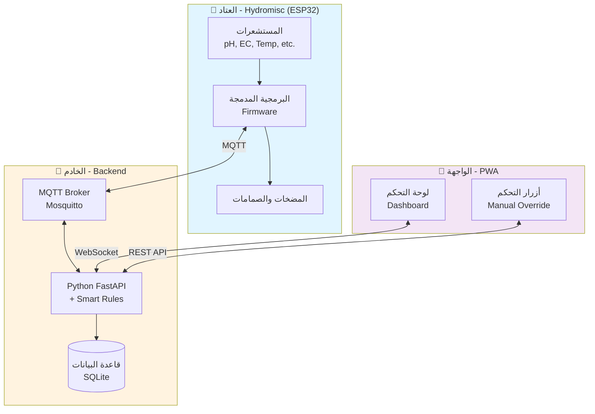

# تقرير المشروع: نظام مراقبة وأتمتة الزراعة المائية

## مقدمة: ما هي الزراعة المائية؟

**الزراعة المائية** هي طريقة زراعة النباتات بدون تربة، حيث تنمو النباتات في محلول مائي غني بالعناصر الغذائية. تعتمد هذه التقنية على توفير جميع العناصر اللازمة للنمو (النيتروجين، الفسفور، البوتاسيوم، وغيرها) مباشرة في الماء.

### لماذا الزراعة المائية؟

- ✅ **توفير الماء**: تستخدم ماء أقل بنسبة 90% من الزراعة التقليدية
- ✅ **نمو أسرع**: تنمو النباتات بشكل أسرع بنسبة 30-50%
- ✅ **إنتاجية أعلى**: يمكن زراعة كمية أكبر في مساحة أقل
- ✅ **تحكم دقيق**: يمكن التحكم بالبيئة بدقة (درجة الحموضة، التغذية، الحرارة)
- ✅ **لا تحتاج تربة**: مناسبة للمناطق الصحراوية أو الحضرية

### التحديات

لكن الزراعة المائية تحتاج **مراقبة دقيقة ومستمرة** لعدة عوامل:
- **درجة الحموضة**: يجب أن تكون بين 5.5 - 6.5 لامتصاص أمثل للعناصر
- **التوصيل الكهربائي**: يقيس تركيز العناصر الغذائية المذابة في الماء
- **درجة حرارة الماء**: المثالية بين 18 - 22 درجة مئوية
- **مستوى الماء**: للتأكد من عدم نفاد المحلول الغذائي

**هنا يأتي دور مشروعنا!** 🚀

---

## هدف المشروع

بناء **نظام مراقبة وأتمتة ذكي** للزراعة المائية يقوم بـ:

1. **المراقبة التلقائية** لجميع المعايير المهمة (الحموضة، التوصيل الكهربائي، درجة الحرارة، الرطوبة، وغيرها)
2. **التحكم الآلي** في المضخات والصمامات لضبط المحلول الغذائي تلقائياً
3. **الإنذارات الفورية** عند حدوث أي مشكلة (مستوى ماء منخفض، حموضة غير مناسبة، وغيرها)
4. **واجهة مستخدم سهلة** على الهاتف المحمول لمراقبة النظام من أي مكان (يمكن تثبيتها كتطبيق)
5. **قواعد ذكية جاهزة** مبرمجة مسبقاً للمبتدئين (مثل: إذا انخفضت الحموضة، أضف محلول رفع الحموضة تلقائياً)

---

## العتاد المستخدم

نستخدم لوحة **هايدروميسك** المبنية على معالج **إي إس بي 32**، وهي مصممة خصيصاً للزراعة المائية:

### المستشعرات
- 📊 **مستشعر الحموضة** (عدد 2): لقياس درجة حموضة الماء بدقة
- 📊 **مستشعر التوصيل الكهربائي** (عدد 2): لقياس تركيز الأملاح المعدنية والعناصر الغذائية
- 🌡️ **مستشعر حرارة رقمي** (دي إس 18 بي 20): لقياس درجة حرارة الماء
- 🌡️ **مستشعر الحرارة والرطوبة** (إيه إم 2301): لقياس درجة حرارة ورطوبة الهواء المحيط
- 📏 **مستشعر مستوى الماء**: للتحقق من كمية الماء في الخزان
- ⚡ **مستشعر التيار الكهربائي**: لمراقبة استهلاك المضخات واكتشاف الأعطال

### المحركات والمتحكمات
- 💧 **8 صمامات كهربائية**: للتحكم في فتح وإغلاق تدفق المحاليل المختلفة
- 🔄 **6 مضخات عادية**: للري وتدوير المحلول الغذائي
- 💉 **4 مضخات دقيقة**: لإضافة المحاليل المركزة بكميات صغيرة ومحددة (محلول رفع الحموضة، محلول خفض الحموضة، محلول أ، محلول ب)
- 💡 **مضخة كبيرة**: للعمليات الرئيسية مثل ملء الخزان

### آلية التحكم
- استخدام **سجل الإزاحة** (شريحة 74HC595) للتحكم بـ 16 مُخرج باستخدام 4 أطراف فقط من المعالج
- التحكم بسرعة المضخات الدقيقة عن طريق **تعديل عرض النبضة** (تقنية بي دبليو إم)

> [!NOTE]
> لدينا [ملف توثيق كامل](file:///d:/Github/HydroMonitor/docs/pinout.md) يحتوي على جميع توصيلات GPIO للعتاد

---

## معمارية النظام

المشروع مقسم إلى **ثلاثة أجزاء رئيسية** تعمل معاً بشكل متكامل:

### 1️⃣ البرمجية المدمجة (الكود المثبت على المعالج)
- **لغة البرمجة**: سي بلس بلس باستخدام منصة بلاتفورم آي أو
- **الوظائف الرئيسية**:
  - قراءة جميع المستشعرات كل عدة ثوانٍ
  - إرسال القراءات عبر بروتوكول الاتصال إم كيو تي تي
  - استقبال الأوامر للتحكم بالمضخات والصمامات
  - الحماية التلقائية (مثل إيقاف المضخة تلقائياً إذا عملت لفترة طويلة جداً)

### 2️⃣ الخادم (العقل المدبر للنظام)
- **لغة البرمجة**: بايثون باستخدام إطار فاست إيه بي آي
- **الوظائف الرئيسية**:
  - استقبال بيانات المستشعرات وحفظها في قاعدة البيانات
  - تطبيق **القواعد الذكية الآلية** (مثال: إذا كانت الحموضة منخفضة → تشغيل مضخة رفع الحموضة تلقائياً)
  - توفير اتصال سريع للواجهة للحصول على بيانات لحظية مباشرة
  - توفير واجهة برمجية للتحكم اليدوي من الهاتف

### 3️⃣ واجهة المستخدم (التطبيق على الهاتف)
- **التقنيات**: تطبيق ويب تقدمي يعمل كتطبيق حقيقي
- **الوظائف الرئيسية**:
  - عرض جميع القراءات في لوحة تحكم جميلة وسهلة الاستخدام
  - أزرار للتحكم اليدوي بالمضخات والصمامات
  - معالج ذكي لمعايرة المستشعرات خطوة بخطوة
  - يمكن تثبيتها كتطبيق على الهاتف المحمول وتعمل حتى بدون إنترنت

---

## ما تم إنجازه حتى الآن ✅

### مرحلة التخطيط والبحث
- ✅ تحديد العتاد: اخترنا لوحة هايدروميسك كمنصة رئيسية
- ✅ دراسة جميع المستشعرات والمحركات المتوفرة في اللوحة
- ✅ **توثيق كامل لتوصيلات الأطراف الإلكترونية** ([ملف التوصيلات](file:///d:/Github/HydroMonitor/docs/pinout.md))
- ✅ تصميم المعمارية الكاملة للنظام بجميع أجزائه

### البرمجية المدمجة على المعالج
- ✅ إنشاء مشروع برمجي على منصة بلاتفورم آي أو
- ✅ إعداد ملف التكوين ([ملف الإعدادات](file:///d:/Github/HydroMonitor/firmware/platformio.ini))
- 🔄 **جارٍ العمل**: تطبيق التحكم بالمضخات الدقيقة عبر تعديل عرض النبضة
- 🔄 **جارٍ العمل**: تطبيق نظام الاتصال بالشبكة اللاسلكية بسهولة للمستخدم
- 🔄 **جارٍ العمل**: برمجة سجل الإزاحة للتحكم بالصمامات والمضخات
- 📝 **قادم**: تطبيق بروتوكول الاتصال وإرسال بيانات المستشعرات

### الخادم (البرنامج الوسيط)
- ✅ إعداد الخادم بلغة بايثون مع إطار العمل السريع
- ✅ تطبيق الاتصال اللحظي السريع للبيانات المباشرة
- ✅ تطبيق **القواعد الذكية الجاهزة** للمبتدئين
- ✅ الكود جاهز وقابل للتشغيل ([ملف الكود الرئيسي](file:///d:/Github/HydroMonitor/software/backend/main.py))

### واجهة المستخدم (التطبيق)
- ✅ إنشاء مشروع تطبيق الويب التقدمي
- ✅ إعداد نظام التصميم الجميل
- ✅ إعداده كتطبيق قابل للتثبيت على الهاتف
- ✅ **تصميم لوحة التحكم الكاملة** مع جميع المستشعرات:
  - مستشعرات المحلول الغذائي (الحموضة، التوصيل الكهربائي، حرارة الماء، مستوى الماء)
  - مستشعرات البيئة المحيطة (حرارة الهواء، الرطوبة، ضغط البخار)
  - مراقبة صحة النظام (استهلاك المضخات الكهربائي)
- ✅ أزرار التحكم السريع لتشغيل المضخات يدوياً
- 📝 **قادم**: ربط الواجهة بالخادم للحصول على بيانات حقيقية
- 📝 **قادم**: معالج المعايرة الذكي خطوة بخطوة

> [!TIP]
> يمكنك الاطلاع على مخطط المهام الكامل في [task.md](file:///d:/Github/HydroMonitor/docs/task.md)

---

## ما المطلوب إنجازه (الخطوات القادمة) 📋

### أولوية عالية 🔥
1. **إكمال البرمجية المدمجة على المعالج**:
   - حل مشكلة التجميع الحالية للمضخات الدقيقة
   - تطبيق نظام الاتصال السهل بالشبكة اللاسلكية
   - برمجة شريحة سجل الإزاحة
   - تطبيل بروتوكول الاتصال بالخادم

2. **اختبار التكامل بين الأجزاء**:
   - التأكد من إرسال البيانات من المعالج إلى الخادم بنجاح
   - ربط تطبيق الهاتف بالخادم

### أولوية متوسطة 🟡
3. **إضافة ميزات التحكم**:
   - لوحة التحكم بالمضخات والصمامات من التطبيق
   - معالج ذكي لمعايرة المستشعرات خطوة بخطوة

4. **القواعد الذكية والأتمتة**:
   - تطبيق السيناريوهات التلقائية (إضافة المحاليل تلقائياً)
   - إنذارات فورية عند وجود مشاكل عبر إشعارات الهاتف

### أولوية منخفضة 🟢
5. **التحسينات والإضافات**:
   - حفظ البيانات التاريخية ورسمها بيانياً
   - إضافة ميزات متقدمة حسب الحاجة

---

## الفائدة المتوقعة من المشروع 🎯

هذا النظام سيوفر:
- ⏱️ **توفير الوقت**: لا حاجة لقياس الحموضة والتوصيل الكهربائي يدوياً كل يوم
- 🎯 **دقة أعلى**: النظام يراقب على مدار الساعة ويتدخل فوراً عند الحاجة
- 📊 **بيانات تاريخية شاملة**: لتحليل أداء النباتات وتحسين الإنتاجية باستمرار
- 🔔 **راحة البال**: إشعارات فورية على الهاتف عند وجود مشاكل حتى لو كنت خارج المنزل
- 🚀 **قابلية التوسع**: يمكن إضافة المزيد من الأحواض أو الميزات لاحقاً بسهولة

---

## التقنيات والأدوات المستخدمة 🛠️

| المجال | التقنية | الغرض |
|--------|---------|-------|
| **العتاد** | معالج إي إس بي 32 (لوحة هايدروميسك) | معالج قوي مع شبكة لاسلكية مدمجة |
| **البرمجية المدمجة** | منصة بلاتفورم آي أو + إطار أردوينو | بيئة برمجة احترافية للمعالجات |
| **بروتوكول الاتصال** | إم كيو تي تي (موسكيتو) | بروتوكول خفيف وسريع لتبادل البيانات |
| **الخادم** | بايثون + إطار فاست إيه بي آي | خادم سريع وعصري للواجهات البرمجية |
| **قاعدة البيانات** | إس كيو إل لايت | تخزين البيانات محلياً بدون تعقيد |
| **واجهة المستخدم** | ريآكت + فايت + تيلويند | إطار عمل سريع لواجهات جميلة |
| **نوع التطبيق** | تطبيق ويب تقدمي | يعمل على الهاتف كتطبيق حقيقي |

---

## كيف يمكنك المساعدة؟ 🤝

يمكنك المساهمة في عدة مجالات:

1. **اختبار وتجربة العتاد**: 
   - التأكد من توصيل المستشعرات بشكل صحيح على اللوحة
   - اختبار عمل المضخات والصمامات الكهربائية
   - قياس دقة قراءات المستشعرات

2. **تطوير وكتابة الأكواد البرمجية**:
   - المساعدة في حل مشاكل التجميع والبرمجة
   - كتابة اختبارات تلقائية للكود
   - إضافة ميزات جديدة للنظام
   - تحسين الأداء وتحسين الكود

3. **تصميم واجهة المستخدم**:
   - تحسين التصميم وتجربة المستخدم
   - إضافة رسوم بيانية تفاعلية للبيانات التاريخية
   - تحسين سهولة الاستخدام على الهاتف

4. **كتابة التوثيق**:
   - كتابة دليل شامل للمستخدمين
   - إنشاء فيديوهات توضيحية لطريقة الاستخدام
   - ترجمة الواجهة للغة العربية
   - كتابة أمثلة وحالات استخدام عملية

---

## الخلاصة 📝

**نظام مراقبة وأتمتة الزراعة المائية** هو مشروع طموح يهدف لجعل الزراعة المائية **أسهل وأكثر ذكاءً** من خلال:
- مراقبة تلقائية مستمرة لجميع المعايير المهمة
- تحكم آلي ذكي بالمحاليل الغذائية
- واجهة سهلة وجميلة على الهاتف المحمول

تم إنجاز **أكثر من 60%** من المشروع، والآن نحتاج للتركيز على **ربط الأجزاء الثلاثة** (البرمجية المدمجة، الخادم، واجهة المستخدم) واختبار النظام بشكل كامل.

---

> [!IMPORTANT]
> **للمزيد من التفاصيل التقنية:**
> - [خطة التنفيذ الكاملة](file:///d:/Github/HydroMonitor/docs/implementation_plan.md)
> - [مخطط المهام](file:///d:/Github/HydroMonitor/docs/task.md)
> - [توثيق التوصيلات](file:///d:/Github/HydroMonitor/docs/pinout.md)
> - [ملخص الإنجازات](file:///d:/Github/HydroMonitor/docs/walkthrough.md)

---

**نرحب بمساعدتك في إكمال هذا المشروع! 🌱💚**
