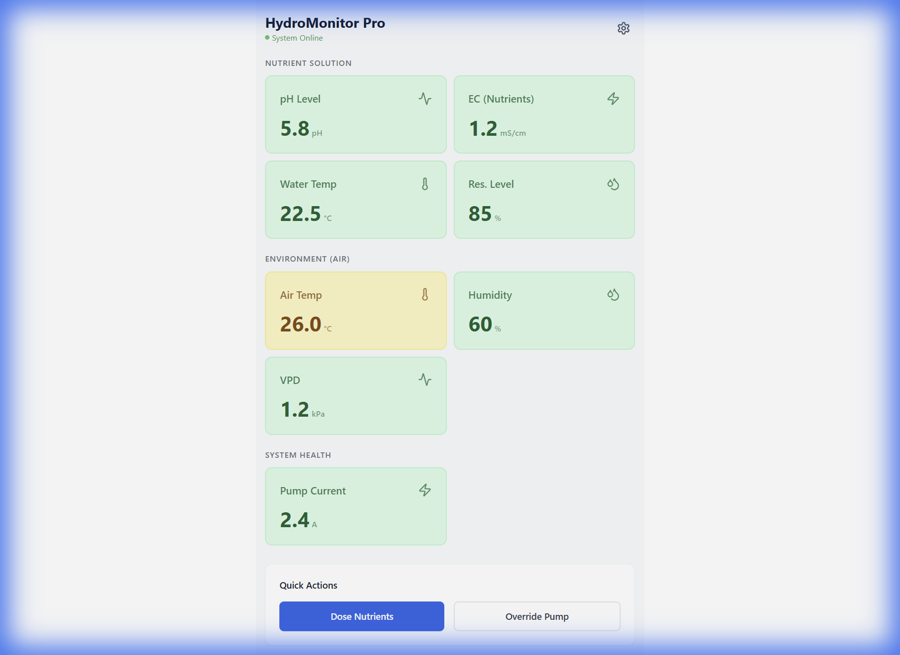

# Frontend Verification - Hydroponic Monitor PWA

## Overview
We have successfully initialized the **Frontend** using React, Vite, and TailwindCSS. The project is configured as a Progressive Web App (PWA), meaning it can be installed on mobile devices.

## Dashboard Preview
The dashboard is running locally at `http://localhost:5173`.
Here is a capture of the current **HydroMonitor Pro** UI state:

## Features Implement (UI Only)
- **Status Header**: Shows system online status.
- **Nutrient Sensors**: pH, EC, Water Temp, Reservoir Level.
- **Environment Sensors**: Air Temp, Humidity, VPD (Calculated).
- **System Health**: Pump Current Monitoring.
- **Quick Actions**: Buttons for manual dosing and pump override.

## Next Steps
- Connect this UI to the Python Backend via WebSockets.
- Replace mock data with real MQTT data from the Firmware.
